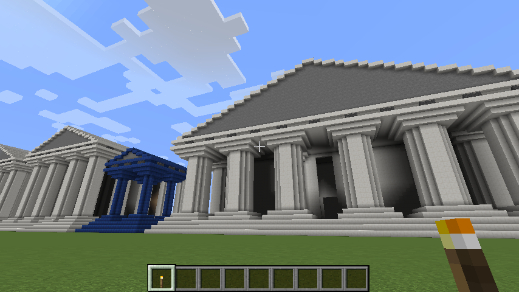

# greekTemples



This set of scripts allows a Minecraft user on a server running [Scriptcraft](https://github.com/walterhiggins/ScriptCraft) to easily create a variety of Ancient Greek-style buildings. [Sample video](https://www.youtube.com/watch?v=BiZ_IGL0--o).

### Dependencies and Installation

* [Scriptcraft installation instructions](https://github.com/walterhiggins/ScriptCraft/blob/master/README.md)
* Place the `greektemples` folder in `/scriptcraft/plugins/`
* In the Minecraft console, type `js refresh()`

### Usage

```
greekTemple(	blocktype,          // minecraft block ID
	            columnRadius,       // 1, 2, or 3
	            numOfColumnsFront,  // must be even, recommended < 8
	            numOfColumnsSide,   // recommended < 10
	            height,             // height of columns
	            doors,              // doors on columns of r > 1
	            walls,              // 'outer', 'inner', or false
	            clearInnerSpace     // only applicable if walls == 'inner'
)
```

So, if you wanted a temple made out of quartz (block ID 155), with large columns, you would type:

\> `greekTemple(155,3,4,4,12,false,false)`

### Warnings

The script is very processor intensive.  Buildings with more than 6 front column or 8 back columns can grind your server to a halt or even crash it.  You have been warned.

The "inner" wall setting, which creates a room in the center of the building, requires at least 4x4 columns.

### To Do

* column door direction
* step blocks (for staircase as well as column base/capital, etc.)
* "extra" settings (columnSpacing,entranceSpacing)
* altar
* ruins
* roof coffering
* roof access
* weapons
* secret chamber
* circular temples
* roman style


### Licence

GPLv3